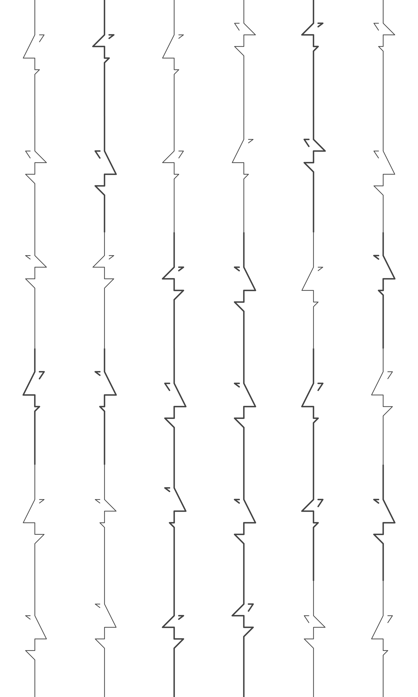
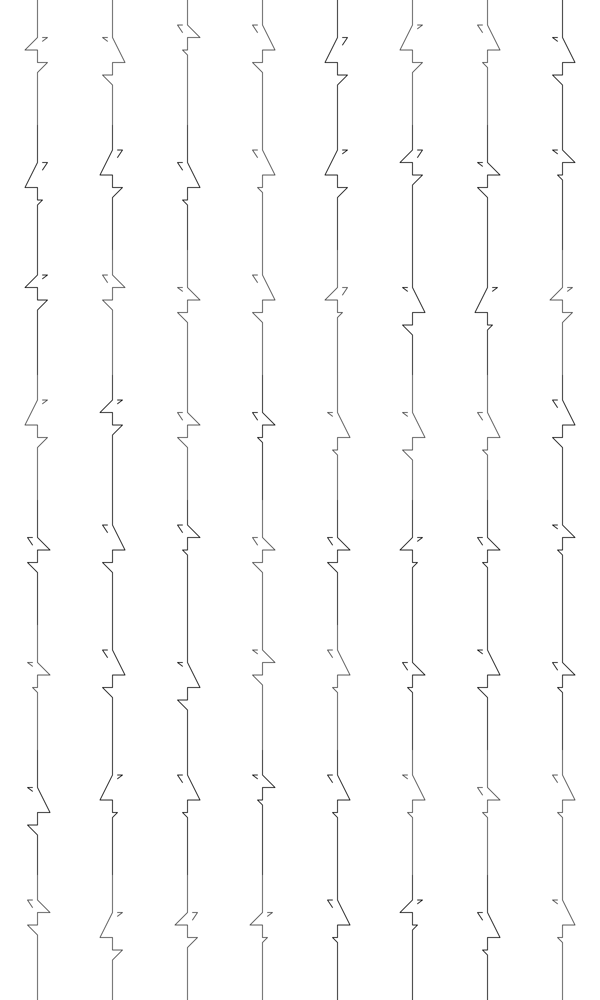

# Procedural Figure Generator

A Python-based system for generating thousands of unique procedural geometric figures and creating artistic collages from them. Perfect for generative art, data visualization backgrounds, or exploring parametric design spaces.

## Features

- **Two generation modes:**
  - **Angled figures** - Complex geometric forms with angular transformations
  - **Simple figures** - Clean straight-line compositions with customizable stroke colors

- **Parametric control** over all geometric properties (distances, angles, stroke width, colors)
- **High-quality anti-aliasing** using supersampling techniques for smooth, vector-like output
- **Collage creation** with advanced filtering, flipping, and grid customization
- **Massive output capability** - Generate thousands of unique variations efficiently

## Installation

```bash
# Clone the repository
git clone <your-repo-url>
cd figure_procedural

# Create and activate virtual environment
python3 -m venv venv
source venv/bin/activate  # On Windows: venv\Scripts\activate

# Install dependencies
pip install -r requirements.txt
```

## Quick Start

### Option 1: All-in-One Pipeline (Recommended)

Generate figures and create a collage in one command:

```bash
# Generate figures with custom parameters and create a 10×10 collage
python3 pipeline.py --a=100,130 --b=50,100 --output_folder ./my_figures --grid_size 10x10

# Full pipeline with filtering and flipping
python3 pipeline.py --a=100,150 --stroke_color=000000,444444 --output_folder ./figures \
         --grid_size 8x8 --flip 0.5 --select_only_from "a100,col000000"

# Generate only (skip collage)
python3 pipeline.py --a=100,130 --b=50,100 --output_folder ./figures --skip_collage
```

### Option 2: Manual Workflow

#### 1. Generate Figures

**Simple Geometric Figures (Recommended):**
```bash
# Generate figures with simplified geometry
python3 generate_figures_simple.py
```

This creates figures with the following parameters:
- `a`, `b`, `c`, `d`, `e`, `f`, `g` - Various distance measurements (px)
- `stroke_width` - Line thickness (3, 6 px)
- `stroke_color` - Hex colors (#000000, #222222, #444444, #666666)

**Output:** Thousands of unique 300×500px images in `./data_simple/`

**Angled Figures (Advanced):**
```bash
# Generate figures with angular transformations
python3 generate_figures.py
```

Includes angle parameters for more complex compositions.

**Output:** ~7,776 unique images in `./data/`

#### 2. Create Collages

```bash
# Basic 5×5 grid collage
python3 create_collages.py --grid_size 5x5 --images_folder ./data_simple

# 10×10 grid with 50% horizontal flip chance
python3 create_collages.py -g 10x10 -i ./data_simple --flip 0.5

# Filter to only use images with specific parameters
python3 create_collages.py -g 8x8 -i ./data_simple -s "a100,col444444"

# Large grid (100×100) with parameter filtering and flipping
python3 create_collages.py -g 100x100 -i ./data_simple -s "w3,c50" -f 0.3 -o ./my_collages
```

## Usage Examples

### Collage Creation Options

```bash
python3 create_collages.py \
  --grid_size 10x16 \           # Grid dimensions (COLSxROWS)
  --images_folder ./data_simple \ # Source images folder
  --output_folder ./collages \   # Output directory (default: ./collages)
  --flip 0.5 \                   # 50% chance to flip images horizontally
  --select_only_from "a100,b50,col444444" # Filter images by parameters
```

**Short flags:**
```bash
python3 create_collages.py -g 5x5 -i ./data_simple -o ./output -f 0.3 -s "w6,c50"
```

### Parameter Filtering

The `--select_only_from` flag lets you filter images by their generation parameters:

- `a100` - Only images where parameter `a` = 100
- `col444444` - Only images with stroke color #444444
- `w3` - Only images with stroke width 3
- Multiple filters: `a100,b50,w3` - Images matching ALL criteria

**Example filenames:**
```
fig_a100_b50_c60_d20_e30_f40_g15_w6_col444444.png
fig_a130_b100_c50_d40_e20_f20_g30_w3_col000000.png
```

## Example Outputs

All examples generated using the pipeline script with custom parameters.

### Pure Black Figures (No Flipping)
6×6 grid with `--select_only_from "col000000"`

```bash
python3 create_collages.py -g 6x6 -i ./data_simple -s "col000000"
```


### Gray Figures with 50% Flip
6×6 grid with `--select_only_from "col444444" --flip 0.5`

```bash
python3 create_collages.py -g 6x6 -i ./data_simple -s "col444444" --flip 0.5
```



### Thin Strokes with 30% Flip
8×8 grid with `--select_only_from "w3" --flip 0.3`

```bash
python3 create_collages.py -g 8x8 -i ./data_simple -s "w3" --flip 0.3
```



## Project Structure

```
figure_procedural/
├── pipeline.py                 # All-in-one generation + collage pipeline
├── generate_figures.py         # Angled figure generator
├── generate_figures_simple.py  # Simple figure generator (recommended)
├── create_collages.py          # Collage creation tool
├── requirements.txt            # Python dependencies
├── venv/                       # Virtual environment (gitignored)
├── data/                       # Generated angled figures (gitignored)
├── data_simple/                # Generated simple figures (gitignored)
├── collages/                   # Output collages (gitignored)
├── examples/                   # Example collages for README
└── README.md
```

## Technical Details

### Anti-Aliasing
Both generators use a multi-stage anti-aliasing approach:
1. Render at 10× resolution (3000×5000px)
2. Draw lines as filled polygons for smooth edges
3. Add circular joints at connection points
4. Downsample to final size (300×500px) using LANCZOS filter

This produces smooth, vector-like quality without actual vector rendering.

### Figure Generation Parameters

**Simple Figures (`generate_figures_simple.py`):**
- Canvas: 300×500px (portrait)
- Parameters: a(100-150), b(50-125), c(50-60), d(20-60), e(20-30), f(20-40), g(15-30)
- Stroke width: 3, 6
- Colors: #000000, #222222, #444444, #666666
- Total combinations: 15,552

**Angled Figures (`generate_figures.py`):**
- Includes angle parameters (g, y) for rotational transformations
- More complex geometric compositions
- Total combinations: 7,776

### Collage Features
- **Sampling with replacement** - Can create grids larger than the source image pool
- **Random selection** - Each collage is unique
- **Horizontal flipping** - Probability-based variation (0.0-1.0)
- **Parameter filtering** - Select subsets by generation parameters
- **Unlimited grid sizes** - From 2×2 to 100×100+ grids

## Performance

**Generation speed:**
- Simple figures: ~2-3 seconds per image (high quality anti-aliasing)
- 15,552 images: ~12-14 hours

**Collage creation:**
- Small grids (5×5): <1 second
- Large grids (100×100): ~30-60 seconds

## Use Cases

- Generative art projects
- Background patterns for designs
- Data visualization elements
- Parametric design exploration
- Abstract composition studies
- Print-on-demand artwork
- NFT collections
- Texture generation

## Customization

Edit the `PARAM_RANGES` dictionary in either generator to customize output:

```python
PARAM_RANGES = {
    'a': [100, 130, 150],           # Your custom values
    'stroke_color': ['#FF0000', '#00FF00', '#0000FF']  # Any hex colors
}
```

## License

MIT License - Feel free to use in your projects!

## Contributing

Contributions welcome! Areas for improvement:
- SVG output format
- Additional geometric primitives
- Color gradients
- Animation sequences
- GUI interface

## Credits

Created with Python and Pillow (PIL). Anti-aliasing techniques inspired by modern graphics rendering pipelines.
