# Procedural Figure Generator

A Python-based system for generating thousands of unique procedural geometric figures and creating artistic collages from them. Perfect for generative art, data visualization backgrounds, or exploring parametric design spaces.

## Features

- **Two generation modes:**
  - **Angled figures** - Complex geometric forms with angular transformations
  - **Simple figures** - Clean straight-line compositions with customizable stroke colors

- **Parametric control** over all geometric properties (distances, angles, stroke width, colors)
- **High-quality anti-aliasing** using supersampling techniques for smooth, vector-like output
- **Collage creation** with advanced filtering, flipping, and grid customization
- **Massive output capability** - Generate thousands of unique variations efficiently

## Installation

```bash
# Clone the repository
git clone <your-repo-url>
cd figure_procedural

# Create and activate virtual environment
python3 -m venv venv
source venv/bin/activate  # On Windows: venv\Scripts\activate

# Install dependencies
pip install -r requirements.txt
```

## Quick Start

### Option 1: Dynamic Pipeline (Recommended - Fastest!)

Generate collages with randomized parameters on-demand - no pre-generation needed!

```bash
# 10×10 collage with random parameters from ranges
python3 dynamic_pipeline.py \
  --a='[100,150]' --b='[50,100]' --c='[40,60]' \
  --stroke_color=ff0000,00ff00,0000ff \
  --grid_size 10x10 --flip_hor 0.5 --flip_ver 0.3 \
  --output_collage_file ./my_collage.png

# Mix ranges and discrete values
python3 dynamic_pipeline.py \
  --a='[100,150]' --b=50,75,100 --c=50 \
  --stroke_width='[3,10]' --stroke_color=000000,444444 \
  --grid_size 8x8 \
  --output_collage_file ./collage.png

# Save individual figures too
python3 dynamic_pipeline.py \
  --a='[100,150]' --stroke_color=ff0000,00ff00,0000ff \
  --grid_size 5x5 \
  --output_folder ./figures \
  --output_collage_file ./collage.png
```

**Parameter Syntax:**
- **Range:** `--a='[100,150]'` → random integer 100-150 for each image
- **List:** `--b=50,75,100` → random choice from [50, 75, 100]
- **Fixed:** `--c=50` → always use 50

**Benefits:**
- ⚡ Much faster - no pre-generation
- 💾 Efficient - only creates what you need
- 🎨 Unique - every image uses random parameters
- 🎲 Flexible - mix ranges, lists, and fixed values

### Option 2: Pre-Generation Pipeline

Generate all combinations first, then create collages:

```bash
# Generate figures with custom parameters and create a 10×10 collage
python3 pipeline.py --a=100,130 --b=50,100 --output_folder ./my_figures --grid_size 10x10

# Full pipeline with filtering and flipping
python3 pipeline.py --a=100,150 --stroke_color=000000,444444 --output_folder ./figures \
         --grid_size 8x8 --flip_hor 0.5 --flip_ver 0.3 --select_only_from "a100,col000000"

# Generate only (skip collage)
python3 pipeline.py --a=100,130 --b=50,100 --output_folder ./figures --skip_collage
```

### Option 3: Manual Workflow

#### 1. Generate Figures

**Simple Geometric Figures (Recommended):**
```bash
# Generate figures with simplified geometry
python3 generate_figures_simple.py
```

This creates figures with the following parameters:
- `a`, `b`, `c`, `d`, `e`, `f`, `g` - Various distance measurements (px)
- `stroke_width` - Line thickness (3, 6 px)
- `stroke_color` - Hex colors (#000000, #222222, #444444, #666666)

**Output:** Thousands of unique 300×500px images in `./data_simple/`

**Angled Figures (Advanced):**
```bash
# Generate figures with angular transformations
python3 generate_figures.py
```

Includes angle parameters for more complex compositions.

**Output:** ~7,776 unique images in `./data/`

#### 2. Create Collages

```bash
# Basic 5×5 grid collage
python3 create_collages.py --grid_size 5x5 --images_folder ./data_simple

# 10×10 grid with 50% horizontal flip and 30% vertical flip
python3 create_collages.py -g 10x10 -i ./data_simple --flip_hor 0.5 --flip_ver 0.3

# Filter to only use images with specific parameters
python3 create_collages.py -g 8x8 -i ./data_simple -s "a100,col444444"

# Large grid (100×100) with parameter filtering and flipping
python3 create_collages.py -g 100x100 -i ./data_simple -s "w3,c50" -f 0.3 -o ./my_collages
```

## Usage Examples

### Collage Creation Options

```bash
python3 create_collages.py \
  --grid_size 10x16 \           # Grid dimensions (COLSxROWS)
  --images_folder ./data_simple \ # Source images folder
  --output_folder ./collages \   # Output directory (default: ./collages)
  --flip_hor 0.5 \               # 50% chance to flip images horizontally
  --flip_ver 0.3 \               # 30% chance to flip images vertically
  --select_only_from "a100,b50,col444444" # Filter images by parameters
```

**Short flags:**
```bash
python3 create_collages.py -g 5x5 -i ./data_simple -o ./output -f 0.3 -s "w6,c50"
```

### Parameter Filtering

The `--select_only_from` flag lets you filter images by their generation parameters:

- `a100` - Only images where parameter `a` = 100
- `col444444` - Only images with stroke color #444444
- `w3` - Only images with stroke width 3
- Multiple filters: `a100,b50,w3` - Images matching ALL criteria

**Example filenames:**
```
fig_a100_b50_c60_d20_e30_f40_g15_w6_col444444.png
fig_a130_b100_c50_d40_e20_f20_g30_w3_col000000.png
```

## Example Outputs

All examples generated using `dynamic_pipeline.py` with randomized parameters.

### 1. Pure Black, Thin Lines (5×5)
Random geometry, fixed thin stroke

```bash
python3 dynamic_pipeline.py --a='[100,150]' --b='[50,100]' --c='[40,60]' \
  --d='[20,60]' --e='[10,30]' --f='[10,40]' --g='[15,30]' \
  --stroke_width=3 --stroke_color=000000 --grid_size 5x5 \
  --output_collage_file ./examples/dynamic_5x5_black_thin.png
```

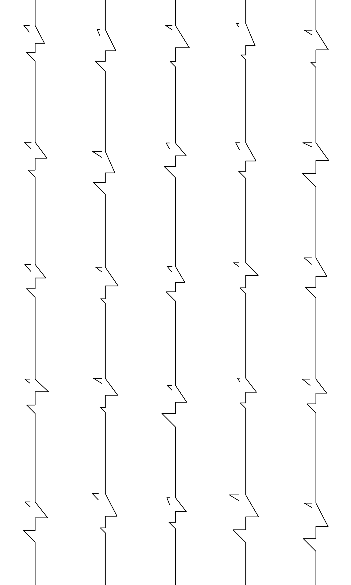

### 2. RGB Colors, Thick Lines (6×6)
Primary colors with 30% horizontal flip

```bash
python3 dynamic_pipeline.py --a='[100,150]' --b='[50,100]' \
  --stroke_width=8 --stroke_color=ff0000,00ff00,0000ff \
  --grid_size 6x6 --flip_hor 0.3 \
  --output_collage_file ./examples/dynamic_6x6_rgb_thick.png
```

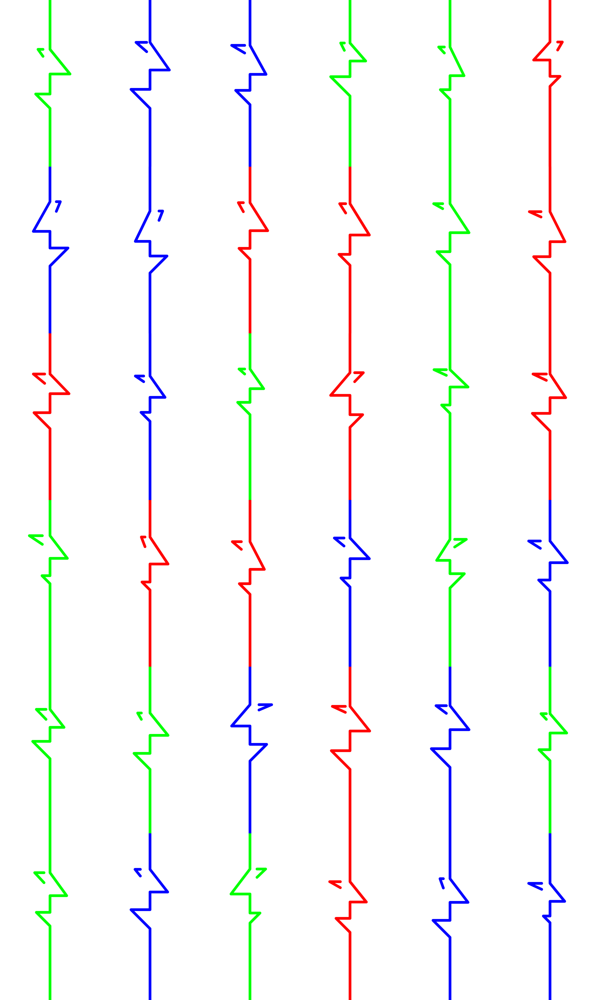

### 3. Grayscale, Varied Width (8×8)
Gray tones with mixed stroke widths

```bash
python3 dynamic_pipeline.py --a='[80,120]' --b='[40,80]' \
  --stroke_width=4,6,8 --stroke_color=444444 \
  --grid_size 8x8 --flip_hor 0.5 \
  --output_collage_file ./examples/dynamic_8x8_gray_varied.png
```

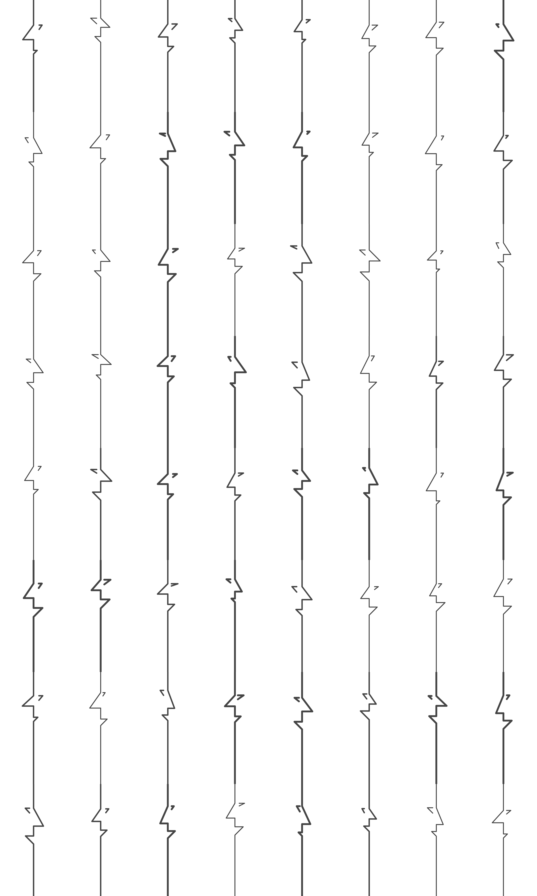

### 4. CMY Colors, Portrait Grid (4×8)
Fixed geometry, cyan-magenta-yellow

```bash
python3 dynamic_pipeline.py --a='[100,150]' --b='[50,100]' \
  --c=50 --d=30 --e=20 --f=25 --g=20 --stroke_width=5 \
  --stroke_color=ff00ff,00ffff,ffff00 --grid_size 4x8 \
  --output_collage_file ./examples/dynamic_4x8_cmyk_fixed.png
```

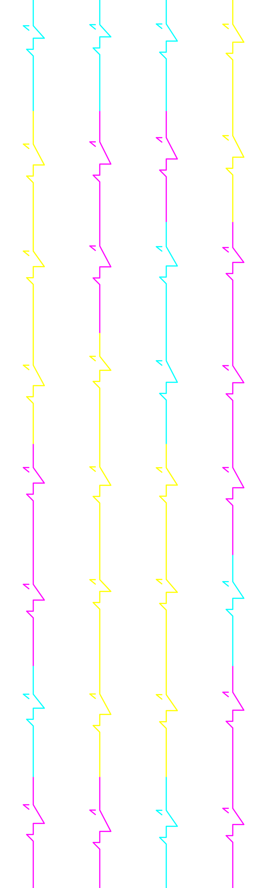

### 5. Grayscale Gradient (10×10)
10 shades of gray, subtle variations

```bash
python3 dynamic_pipeline.py --a='[120,140]' --b='[60,90]' \
  --stroke_width=2,4 \
  --stroke_color=000000,111111,222222,333333,444444,555555,666666,777777,888888,999999 \
  --grid_size 10x10 --flip_hor 0.4 \
  --output_collage_file ./examples/dynamic_10x10_grayscale.png
```

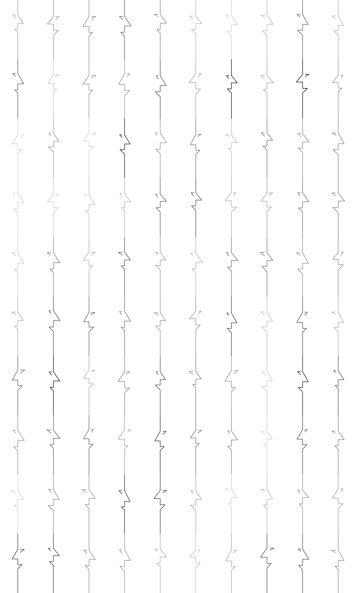

### 6. Warm Colors, Discrete Values (3×6)
Orange-red-gold palette

```bash
python3 dynamic_pipeline.py --a=100,120,140 --b=50,75,100 \
  --stroke_width=10 --stroke_color=8b0000,ff4500,ffd700 \
  --grid_size 3x6 --flip_hor 0.2 \
  --output_collage_file ./examples/dynamic_3x6_warm_discrete.png
```

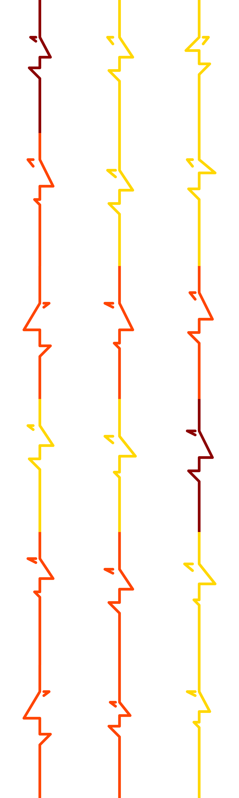

### 7. Blue Shades, Thin Lines (7×7)
Navy to sky blue, delicate strokes

```bash
python3 dynamic_pipeline.py --a='[90,130]' --b='[45,85]' \
  --stroke_width=1,2,3 --stroke_color=000080,4169e1,87ceeb \
  --grid_size 7x7 --flip_hor 0.6 \
  --output_collage_file ./examples/dynamic_7x7_blues_thin.png
```

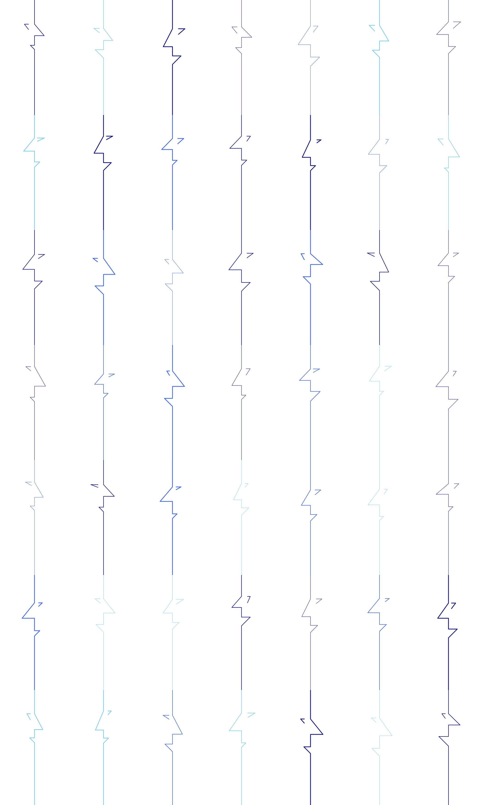

### 8. Green Forest, Tight Ranges (12×8)
Natural greens, consistent geometry

```bash
python3 dynamic_pipeline.py --a='[110,130]' --b='[55,75]' \
  --c='[48,52]' --d='[28,32]' --stroke_width=6 \
  --stroke_color=228b22,32cd32,90ee90,006400 \
  --grid_size 12x8 --flip_hor 0.5 \
  --output_collage_file ./examples/dynamic_12x8_greens_tight.png
```

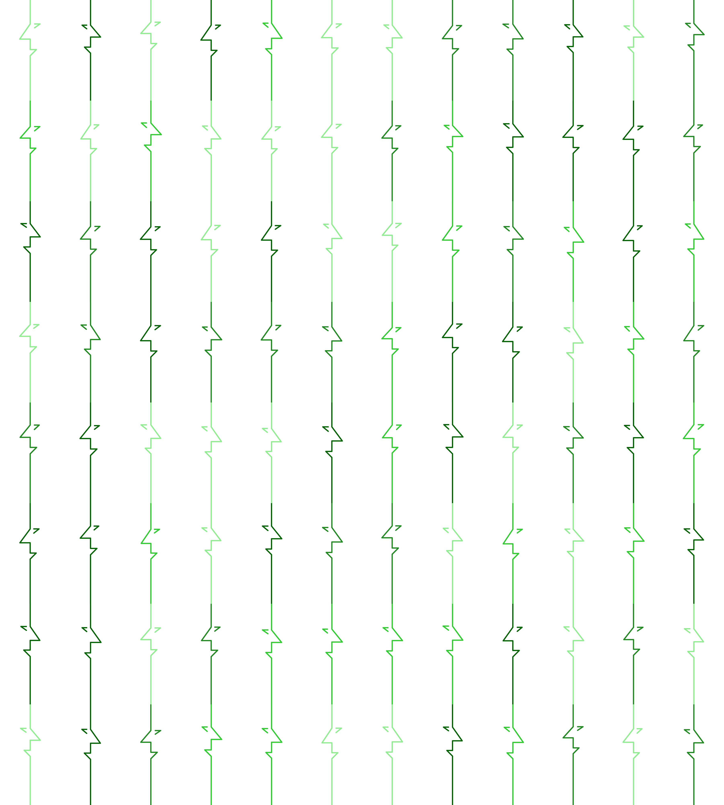

### 9. Purple Chaos, Wide Ranges (9×9)
Maximum variation in all parameters

```bash
python3 dynamic_pipeline.py --a='[95,145]' --b='[48,98]' \
  --stroke_width='[3,10]' \
  --stroke_color=800080,9370db,ba55d3,dda0dd,ee82ee \
  --grid_size 9x9 --flip_hor 0.7 \
  --output_collage_file ./examples/dynamic_9x9_purples_wild.png
```

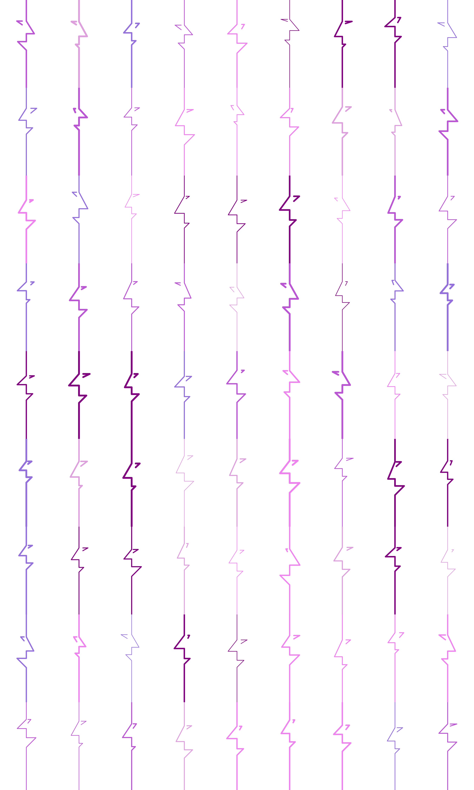

### 10. Pink Uniform (6×4)
Identical geometry, color-only variation

```bash
python3 dynamic_pipeline.py --a=130 --b=70 --c=50 --d=35 --e=20 --f=25 --g=20 \
  --stroke_width=12 --stroke_color=ff1493,ff69b4,ffc0cb \
  --grid_size 6x4 \
  --output_collage_file ./examples/dynamic_6x4_pinks_uniform.png
```

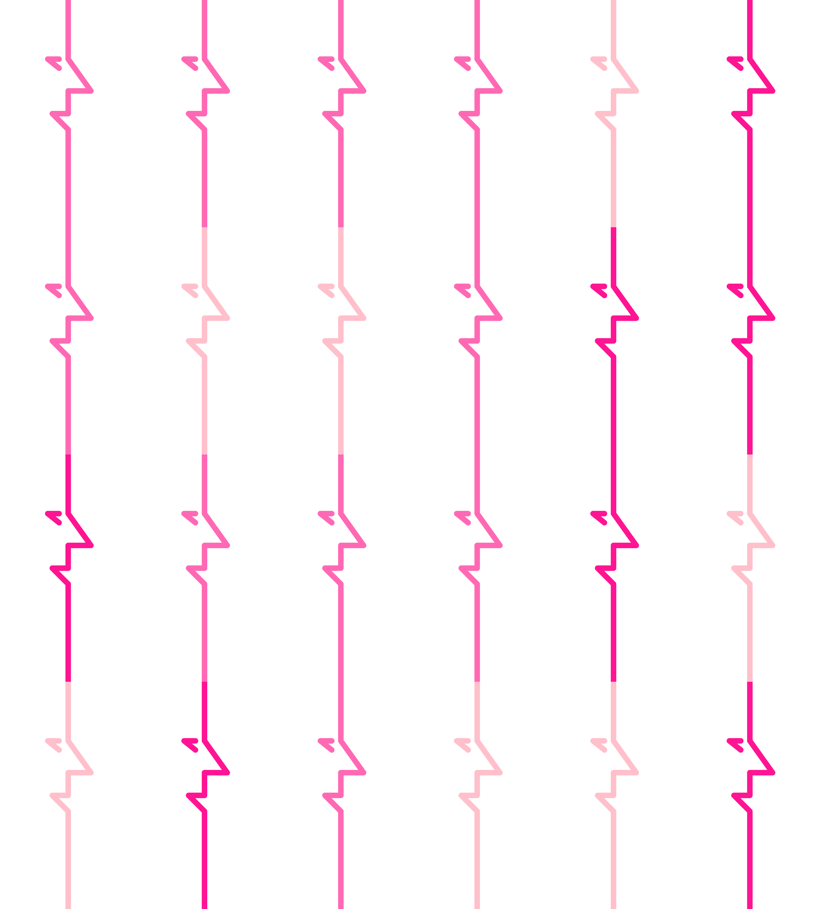

### 11. Rainbow Chaos (15×10)
Maximum variety - all parameters randomized

```bash
python3 dynamic_pipeline.py --a='[100,150]' --b='[50,100]' \
  --stroke_width='[1,12]' \
  --stroke_color=000000,ff0000,00ff00,0000ff,ffff00,ff00ff,00ffff,ffffff \
  --grid_size 15x10 --flip_hor 0.5 \
  --output_collage_file ./examples/dynamic_15x10_rainbow_chaos.png
```

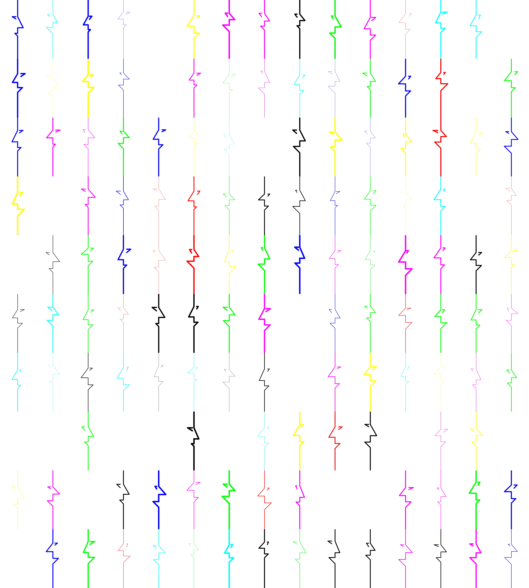

## Project Structure

```
figure_procedural/
├── dynamic_pipeline.py         # ⭐ Dynamic on-demand generation (FASTEST!)
├── pipeline.py                 # Pre-generation + collage pipeline
├── generate_figures.py         # Angled figure generator
├── generate_figures_simple.py  # Simple figure generator
├── create_collages.py          # Collage creation tool
├── requirements.txt            # Python dependencies (Pillow, tqdm)
├── venv/                       # Virtual environment (gitignored)
├── data/                       # Generated angled figures (gitignored)
├── data_simple/                # Generated simple figures (gitignored)
├── collages/                   # Output collages (gitignored)
├── examples/                   # Example collages for README
└── README.md
```

## Technical Details

### Anti-Aliasing
Both generators use a multi-stage anti-aliasing approach:
1. Render at 10× resolution (3000×5000px)
2. Draw lines as filled polygons for smooth edges
3. Add circular joints at connection points
4. Downsample to final size (300×500px) using LANCZOS filter

This produces smooth, vector-like quality without actual vector rendering.

### Figure Generation Parameters

**Simple Figures (`generate_figures_simple.py`):**
- Canvas: 300×500px (portrait)
- Parameters: a(100-150), b(50-125), c(50-60), d(20-60), e(20-30), f(20-40), g(15-30)
- Stroke width: 3, 6
- Colors: #000000, #222222, #444444, #666666
- Total combinations: 15,552

**Angled Figures (`generate_figures.py`):**
- Includes angle parameters (g, y) for rotational transformations
- More complex geometric compositions
- Total combinations: 7,776

### Collage Features
- **Sampling with replacement** - Can create grids larger than the source image pool
- **Random selection** - Each collage is unique
- **Horizontal & vertical flipping** - Independent probability-based variation (0.0-1.0)
- **Parameter filtering** - Select subsets by generation parameters
- **Unlimited grid sizes** - From 2×2 to 100×100+ grids

## Performance

**Generation speed:**
- Simple figures: ~2-3 seconds per image (high quality anti-aliasing)
- 15,552 images: ~12-14 hours

**Collage creation:**
- Small grids (5×5): <1 second
- Large grids (100×100): ~30-60 seconds

## Use Cases

- Generative art projects
- Background patterns for designs
- Data visualization elements
- Parametric design exploration
- Abstract composition studies
- Print-on-demand artwork
- NFT collections
- Texture generation

## Customization

Edit the `PARAM_RANGES` dictionary in either generator to customize output:

```python
PARAM_RANGES = {
    'a': [100, 130, 150],           # Your custom values
    'stroke_color': ['#FF0000', '#00FF00', '#0000FF']  # Any hex colors
}
```

## License

MIT License - Feel free to use in your projects!

## Contributing

Contributions welcome! Areas for improvement:
- SVG output format
- Additional geometric primitives
- Color gradients
- Animation sequences
- GUI interface

## Credits

Created with Python and Pillow (PIL). Anti-aliasing techniques inspired by modern graphics rendering pipelines.
